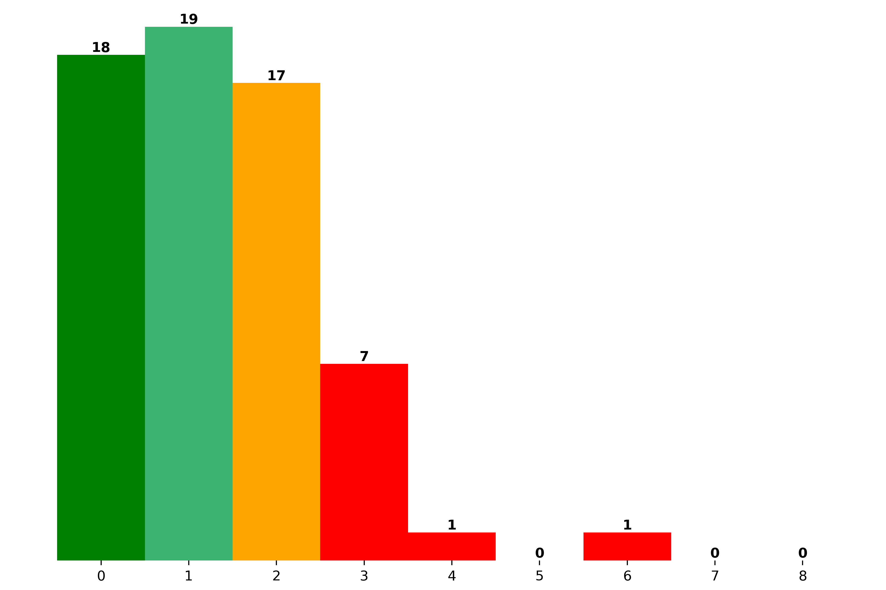
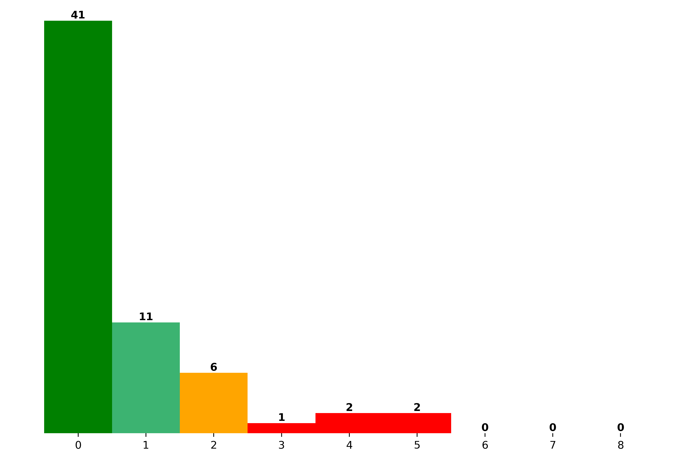

# Visual Calculator
The core idea of this project is to calculate hand written equations from images. The images may for example look like:  
|  |  |  |
|:--:| :--: | :--:|
| Equation made by concatenating separate digits and operators | Equation written digitally | Handwritten equation |

For further description of this project, see the proposal (``proposal.pdf``) and the (``report.pdf``).

## Authors
David Mihola, david.mihola@student.tugraz.at  
Robert Stojanovic, robert.stojanovic@student.tugraz.at  

## Repository structure
```
--|
  |-- annotation/                 - scripts for creating our own data set with digits and operators
  |
  |-- data_generation/            - scripts for generating and plotting data set with equations
  |
  |-- models/                     - weights of trained models
  |
  |-- networks/                   - scripts with our models, data loaders, loss functions ect.
  |
  |-- own_data/                   - our own data set with digits and operators
  |
  |-- results/                    - plots with results
  |
  |-- screenshots/                - screenshots of the GUI application
  |
  |-- testing/                    - test images of mostly actually handwritten equations and scripts for testing
  |
  |-- training_logs/              - files with captured progress of training of our models
  |
  |-- const_config.py             - script with constants used in all other scripts
  |
  |-- final.py                    - the final script for data sets pre-processing, trainig and evaluation
  |
  |-- GUI.py                      - the GUI application
  |
  |-- label_extractors.py         - script for extraction of text labels from the output of our models
  |
  |-- proposal.pdf                - the proposal of this project
  |
  |-- README.md                   - this file
  |
  |-- report.pdf                  - the final report with detailed description of this project
  |
  |-- requirements.txt            - the python requirements to run our scripts 
```

## Requirements
The application was run and tested on a linux environment, so we cannot guarantee it working on other operating systems.

We mainly use common python libraries for machine learning and image pre-processing, install these with
```
pip install -r requirements.txt
```
Additionaly, you will need to install the following libraries with
```
sudo apt install unrar python3-tk python3-pil python3-pil.imagetk 
```

## Training, Validating and Testing Data
Download these data sets:
* https://www.kaggle.com/datasets/xainano/handwrittenmathsymbols,
* https://www.kaggle.com/datasets/michelheusser/handwritten-digits-and-operators,
* https://github.com/sueiras/handwritting_characters_database,

rename them respectively to:
* ``handwrittenmathsymbols.zip``,
* ``handwritten-digits-and-operators.zip``,
* ``handwritting_characters_database.tar.gz``

and put the renamed downloaded files to a ``downloads/`` directory in the root directory of the project.

## Result reproduction
We prepared a final (``final.py``) script to reproduce the results shown in the report. Using the script you can conveniently train the neural networks or display results using already trained weights by us. Retraining will not changed the results, as we have fixed the randomness. Run the script with
```
python3 final.py [-h] [-u] [-p] [-g] [-d] [-pd] [-t {MSER_classifier,custom_recursive_CNN,custom_CNN}]
                 [-e {MSER_classifier,custom_recursive_CNN,custom_CNN}] [-prMC] [-prMSER] [-pr]

options:
  -h, --help                    Show this help message and exit.
  -u, --unzip                   Perform extraction of relevant files from the downloaded data sets.
  -p, --preprocessing           Perform file preproccessing of extracted data sets.
  -g, --equation_generation     Perform equation generation from preproccesed data sets.
  -d, --dataset                 Perform all data set related tasks.
  -pd, --plot_dataset           Plot separate symbols and whole equations.
  -t {MSER_classifier,custom_recursive_CNN,custom_CNN}, --train {MSER_classifier,custom_recursive_CNN,custom_CNN}
                                Train specified model.
  -e {MSER_classifier,custom_recursive_CNN,custom_CNN}, --evaluate {MSER_classifier,custom_recursive_CNN,custom_CNN}
                                Evaluate specified model.
  -na, --no_augmentation        Train or evaluate model on not augmented data sets, use with -t (--train) and -e (--evaluate) options.
  -eMC, --evaluate_MC           Evaluate the multi multi-classifier (custom_recursive_CNN) with and without augmentation.
  -prMC, --plot_results_MC      Plot results of the multi-classifier (custom_recursive_CNN).
  -prMSER, --plot_results_MSER  Plot results of the MSER based classifier.
  -pr, --plot_results           Plot results of an ensemble of the multi-classifier and the MSER based classifier.
```
Additionaly, we provide a GUI script (``GUI.py``), which lets you select an image from your local storage and displays the results of equations on it. We also provide testing images in the ``testing/`` directory and its subdirectories with the GUI script.

### Examples of final script commands
``python3 final.py -d                           `` - Pre-processes, cleans, augments and generates equations from the downloaded data sets, this **must be run first** before any of the following commands.   
``python3 final.py -prMC -prMSER -pr            `` - Plots all results as bar plot of Levenshtein distances.  
``python3 final.py -e MSER_classifier           `` - Evaluates the classifier on augmented data set and plots a confusion matrix.  
``python3 final.py -e custom_recursive_CNN      `` - Evaluates the recursive CNN on augmented data set and plots a bar plot of Levenshtein distances.  
``python3 final.py -eMC                         `` - Evaluates the recursive CNN on augmented and not augmented data sets and plots a bar plot of Levenshtein distances.  
``python3 final.py -t custom_recursive_CNN      `` - Trains the recursive CNN on augmented data.

### Screenshots of the GUI
|  |  |  |
|:--:| :--: | :--:|
| Starting screen | Selection of an image with an equation or equations | Calculated results of detected equations |

## Results
We evaluated our approaches using the Levenshtein distance between the ground truth text label and the predicted text label on actual handwritten equations from several writers.
|  |  |  |
|:--:| :--: | :--:|
| Results of the MSER approach | Results of the fully ML based approach | Results of the ensemble of the two approaches |