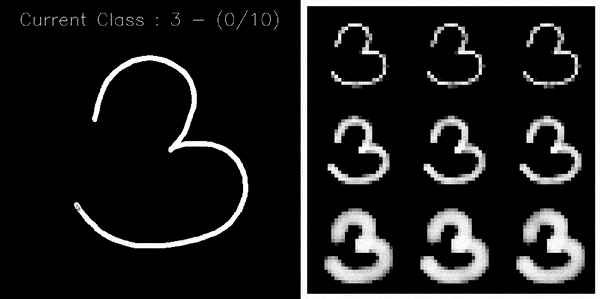

# Python-Interface-to-Create-Handwritten-dataset
Python Interface to Create Handwritten dataset

Original Repo: https://github.com/AxelThevenot/Python-Interface-to-Create-Handwritten-dataset

Original article and full tutorial : [Build Your Fully Configurable Interface to Create MNIST-like Dataset with Python in 10 Minutes](https://medium.com/@axel.thevenot/43ab414a875e?source=friends_link&sk=228606329a318e9bd743515787c1e101)




## Requirements
```
pip3 install numpy opencv-python
```

## Execution
If present delete or rename the existing dataset folder (Required due to bug)
```
python3 main.py -c path/to/the/config/file.json
or 
python3 main.py (for default config.json)
```

If the drawing seems laggy, try resizing the window slightly (bug)

## Usage
Draw the digit or operator which is shown as current class: "..."

(x/y) refers to the current image count of the class (x) and the required total count (y)

It is recommended to finish the annotation for all classes as resuming is currently broken (max total count can be set in the config under volume)

* Clearing canvas ("C" or "U")
* Next annotation ("Space" or "Enter")
* Exit ("Esc")

## Conversion to numpy data
After finishing the annotation you can convert and store the images in a single numpy array by executing:
```
python3 converter.py
```
This will save two npy files (one containing the image data and the other containing the labels) in the dataset folder which can then be used for training


## Configuration JSON file

*  ***input → H*** (int): height of the drawing image
*  ***input → W*** (int): width of the drawing image
*  ***input → thickness*** (float): proportionnal thickness according to the diagonal of the image size
*  ***output → H*** (int): height of the output image
*  ***output → W*** (int): width of the output image
*  ***output → crop*** (bool): whether to crop the output image to only be the region where the user has drawn 
*  ***process → volume*** (int): number of sample by class we can to get at the end
*  ***process → selection*** (str): process of selection. can be RANDOM|CLASSBYCLASS|ROTATE
*  ***process → display_output*** (bool): display the ouput in a window or not
*  ***storage → root*** (str): path to the root folder
*  ***storage → by_class_name*** (bool): store classes in subfolders
*  ***line → thickness*** (int or list of int): proportionnal thickness according to the diagonal of the input size
*  ***line → range_value*** (int or list of int): random range for line value when drawing if list else value for the line
*  ***line → fading*** (float): value of the border fade for a linear fading
*  ***interpolation → method*** (str or list of str): OpenCV interpolation for resizing to ouput. Can be INTER_NEAREST|INTER_LINEAR|INTER_AREA|INTER_CUBIC|INTER_LANCZOS4|RANDOM
*  ***classes*** (list of str): contains the name of all the caracters


Enjoy !
